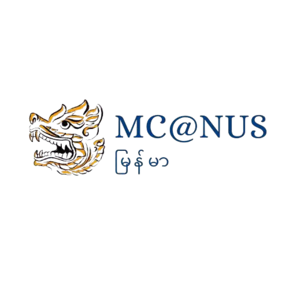

    
    <h1 align="center">Myanmar Community @ NUS</h1>

> A community-driven website for Burmese students at the National University of Singapore (NUS), built with Next.js and Tailwind CSS.

🌐 **Live site:** [https://myanmarcommunitynus.com](https://myanmarcommunitynus.com)

---

## 📌 About

This website serves as the official digital home of the **Myanmar Community at NUS**. It helps:
- Promote cultural exchange and understanding
- Connect Burmese students across faculties and batches
- Share updates about events, initiatives, and support resources

🎯 **Mission:** To promote cultural exchange and mutual support amongst NUS students and alumni.  
🌟 **Vision:** To foster a vibrant and united community through shared memorable experiences.

---

## 🚀 Features

- 📰 Home page with mission, vision, and introduction
- 🎉 Upcoming events and past highlights
- 📸 Photo gallery and activity recap
- 📬 Contact and membership information
- ⚡ Fast and SEO-friendly with [Next.js App Router](https://nextjs.org/docs/app)

---

## 🛠️ Tech Stack

- **Framework:** [Next.js 14](https://nextjs.org/)
- **Styling:** [Tailwind CSS](https://tailwindcss.com/)
- **Deployment:** [Vercel](https://vercel.com/)

---

## 🤝 Contributing

We welcome contributions from anyone interested in supporting or improving this community website!
